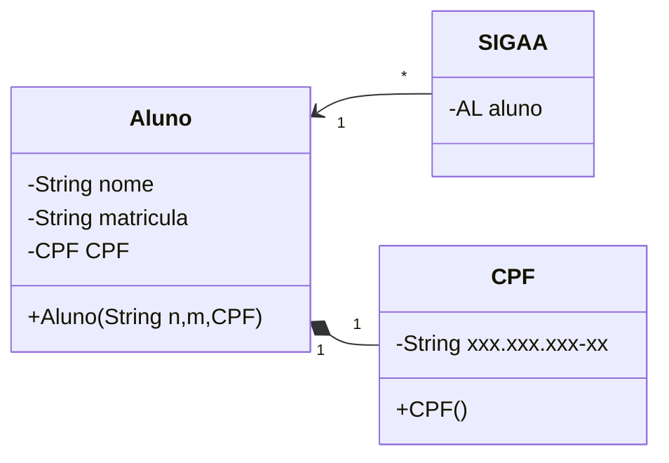

# Diagrama de classes UML
<!-- Acessar https://mermaid.live para documentação completa -->

```mermaid  

classDiagram
direction LR
class Aluno{
    -String nome
    -String matricula
    -CPF CPF
    +Aluno(String n,m,CPF)
}

class SIGAA{
    -AL<Aluno> aluno

}
class CPF{
    -String xxx.xxx.xxx-xx
    +CPF()

}

Aluno "1"<-- "*" SIGAA
Aluno "1"*-- "1" CPF


```