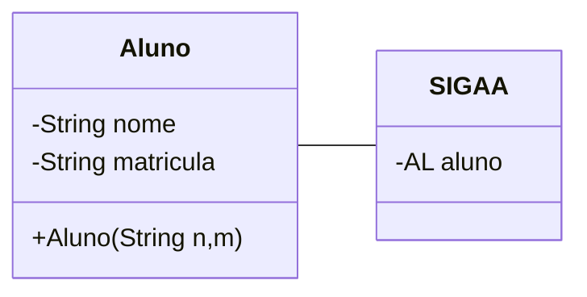

# Diagrama de classes UML
<!-- Acessar mermaid.js.org para documentação completa -->

```mermaid  

classDiagram
direction LR
class Aluno{
    -String nome
    -String matricula
    +Aluno(String n,m)
}

class SIGAA{
    -AL<Aluno> aluno

}

Aluno -- SIGAA
```