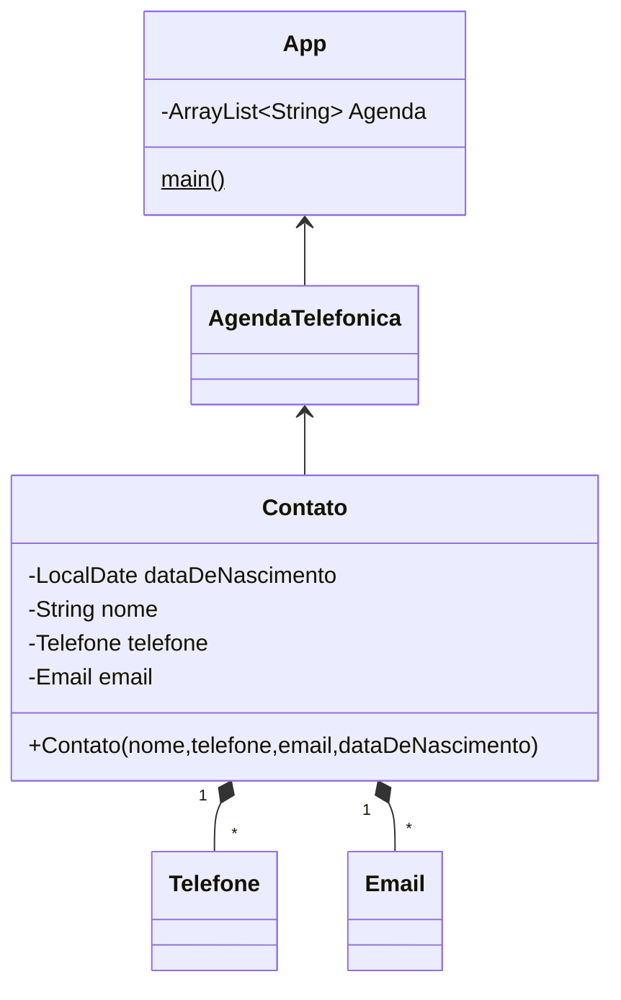

```mermaid

classDiagram

class App{
    -ArrayList~String~ Agenda
    main()$

}

class AgendaTelefonica

class Contato{
    -LocalDate dataDeNascimento
    -String nome
    -Telefone telefone
    -Email email
    +Contato(nome,telefone,email,dataDeNascimento)
  }

class Telefone
class Email{
    
}
App <-- AgendaTelefonica
AgendaTelefonica <-- Contato


Contato "1"*--"*" Telefone
Contato "1"*--"*" Email

```