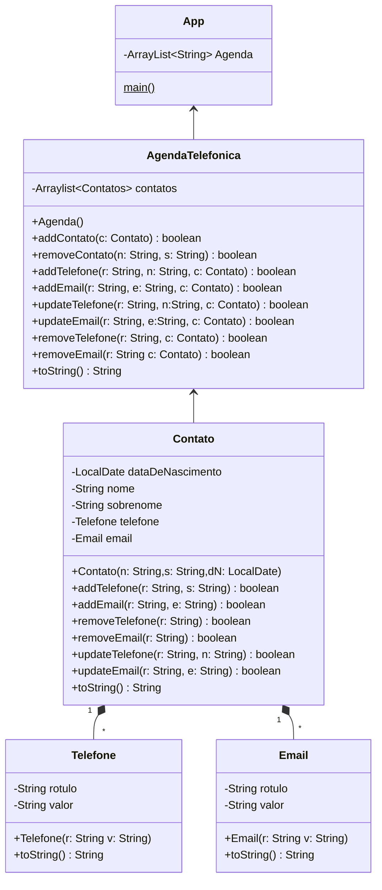

```mermaid

classDiagram

class App{
    -ArrayList~String~ Agenda
    main()$

}

class AgendaTelefonica{
  -Arraylist~Contatos~ contatos
  +Agenda()
  +addContato(c: Contato) boolean
  +removeContato(n: String, s: String) boolean
  +addTelefone(r: String, n: String, c: Contato) boolean
  +addEmail(r: String, e: String, c: Contato) boolean
  +updateTelefone(r: String, n:String, c: Contato) boolean
  +updateEmail(r: String, e:String, c: Contato) boolean
  +removeTelefone(r: String, c: Contato) boolean
  +removeEmail(r: String c: Contato) boolean
  +toString() String
}

class Contato{
    -LocalDate dataDeNascimento
    -String nome
    -String sobrenome
    -Telefone telefone
    -Email email
    +Contato(n: String,s: String,dN: LocalDate)
    +addTelefone(r: String, s: String) boolean
    +addEmail(r: String, e: String) boolean
    +removeTelefone(r: String) boolean
    +removeEmail(r: String) boolean
    +updateTelefone(r: String, n: String) boolean
    +updateEmail(r: String, e: String) boolean
    +toString() String


  }

class Telefone{
  -String rotulo
  -String valor
  +Telefone(r: String v: String)
  +toString() String

}

class Email{
  -String rotulo
  -String valor
  +Email(r: String v: String)
  +toString() String
    
}
App <-- AgendaTelefonica
AgendaTelefonica <-- Contato


Contato "1"*--"*" Telefone
Contato "1"*--"*" Email

```