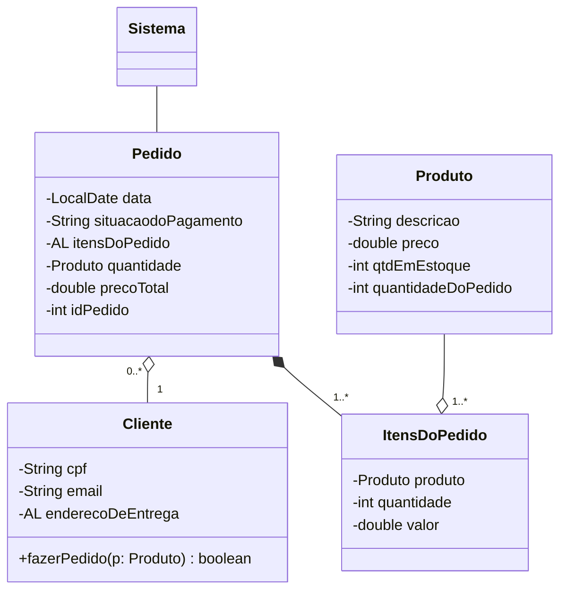

```mermaid

classDiagram

class Sistema

class Produto{
    -String descricao
    -double preco
    -int qtdEmEstoque
    -int quantidadeDoPedido
}
class Cliente{
    -String cpf
    -String email
    -AL<endereço> enderecoDeEntrega
    +fazerPedido(p: Produto) boolean
}
class Pedido{
    -LocalDate data
    -String situacaodoPagamento
    -AL<ItensDoPedido> itensDoPedido
    -Produto quantidade
    -double precoTotal
    -int idPedido
}
class ItensDoPedido{
    -Produto produto
    -int quantidade
    -double valor
}

Sistema -- Pedido
Pedido "0..*"o-- "1" Cliente
Pedido *-- "1..*"ItensDoPedido
Produto --o "1..*"ItensDoPedido

```