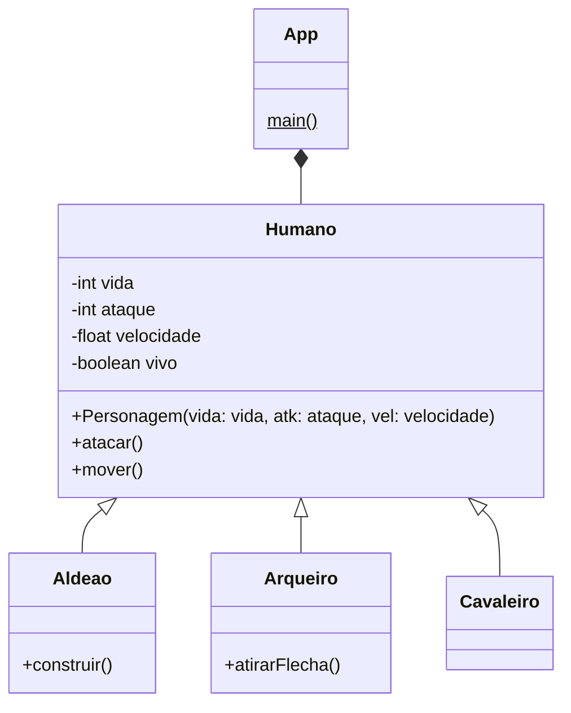

```mermaid

classDiagram

class App{
    main()$

}

class Humano{
  -int vida
  -int ataque
  -float velocidade
  -boolean vivo
  +Personagem(vida: vida, atk: ataque, vel: velocidade) 
  +atacar()
  +mover()
}

class Aldeao{
    +construir()
  }

class Arqueiro{
  +atirarFlecha()
}

class Cavaleiro{
  
}
App *-- Humano
Humano <|-- Aldeao
Humano <|-- Arqueiro
Humano <|-- Cavaleiro

```