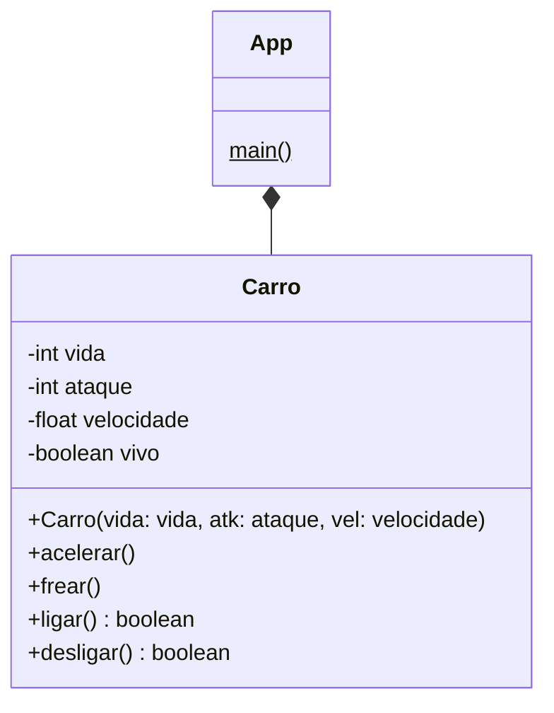

```mermaid

classDiagram

class App{
    main()$

}

class Carro {
  -int vida
  -int ataque
  -float velocidade
  -boolean vivo
  +Carro(vida: vida, atk: ataque, vel: velocidade)
  +acelerar()
  +frear()
  +ligar() boolean
  +desligar() boolean
}


App *-- Carro

```